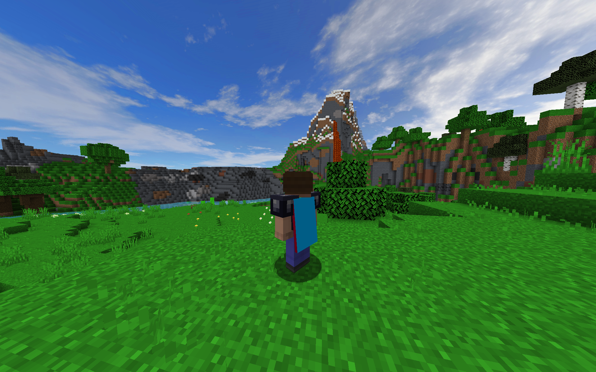

# mc_cape_template
Full template for Minecraft capes (tested `1.7.10`, `1.8.9`, `1.12.2`)

This table right here indicates the meaning of the colors:

　　

　|　
-|-
 | 
 |
 | 

Specification of the parts

the right wing is mirrored from the left wing　／ 右翼わ左翼の鏡像

How it would look as is ingame:

